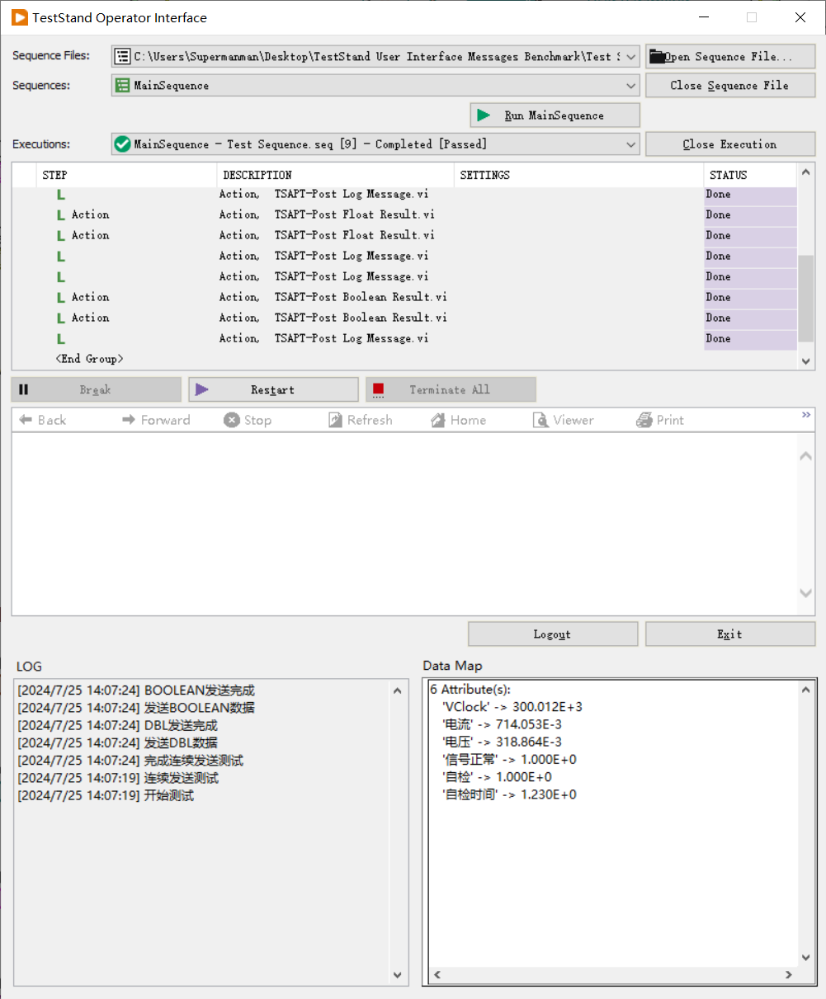
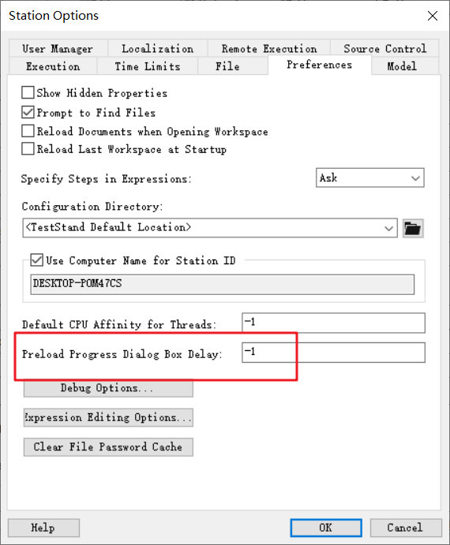
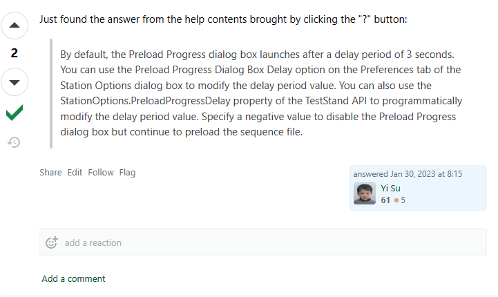

> ## UIMessage
>
> 通常通过 UIMessage 处理实时的运行状态和实时信息。
>
> OI 和 SEQ 之间需要约定通讯的信息，例如：
> [SEQ-OI 数据传输协议](SEQ-OI%20数据传输协议.docx)
>
> 界面需要设计的通用，根据协议编写界面，而不是传输的内容。 以 LabVEIW OI 为例：
>
> 
>
> 参考：
> - [使用TestStand用户界面消息（UI消息）](https://knowledge.ni.com/KnowledgeArticleDetails?id=kA03q000000x3tWCAQ&l=en-US)

> ## 并行测试
>
> - [为 TestStand 序列文件指定过程模型](https://knowledge.ni.com/KnowledgeArticleDetails?id=kA00Z000000P7NrSAK&l=zh-CN)
> - [Changing TestStand Process Model in Sequence Editor and Operator Interface](https://knowledge.ni.com/KnowledgeArticleDetails?id=kA03q000000YICwCAO&l=zh-CN)
> - [以编程方式在TestStand中设置Test Socket的数量](https://knowledge.ni.com/KnowledgeArticleDetails?id=kA00Z000000P7p7SAC&l=zh-CN)
>
> testsocket index
>
> RunState.TestSockets.MyIndex
>
> 隐藏 Pre-loading Modules 对话框
>
> 
>
> 参考：
>
>